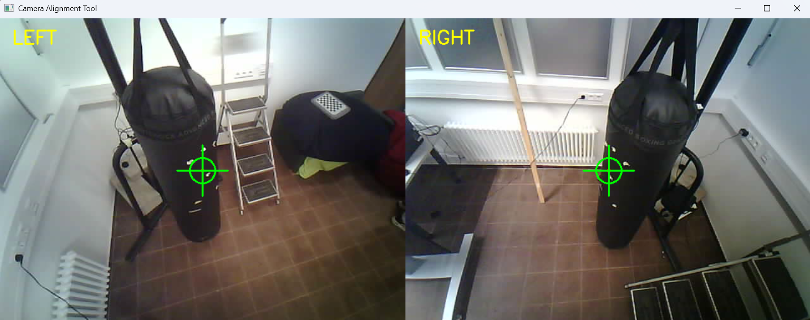
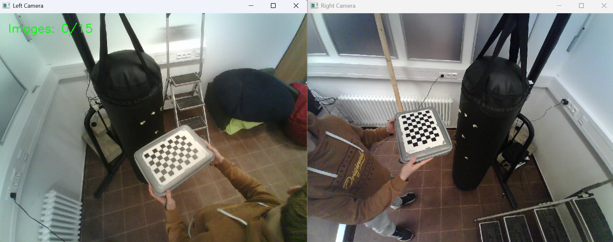
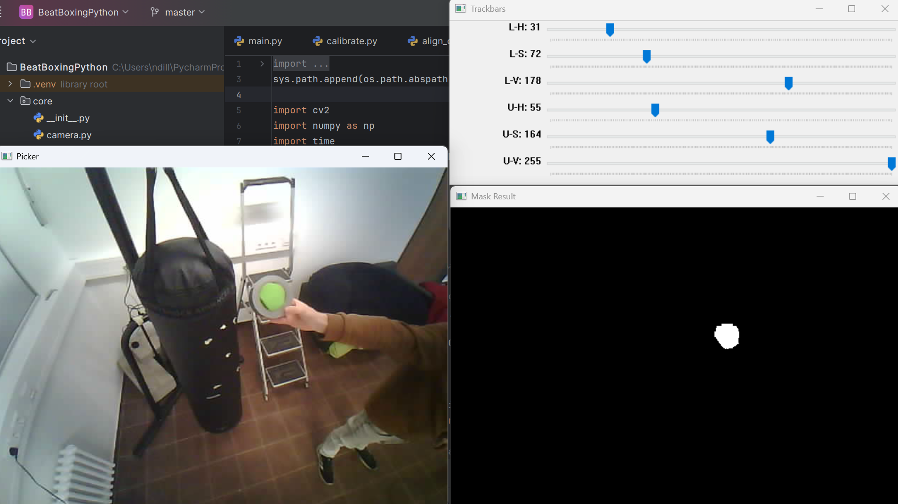

## 🚀 Stereoscopic Hand Tracking System

The system captures video from two **ESP32-CAM** modules, processes the data using Python (OpenCV), and calculates the 3D coordinates ($X, Y, Z$) for **two separate hands** simultaneously. This data is streamed to Unity via UDP in real-time.

### Key Features

* **Dual-Hand Tracking:** Tracks two distinctly colored gloves simultaneously (e.g., Red for Left, Blue for Right).
* **Stereoscopic Depth:** Uses triangulation to calculate true 3D depth, not just 2D position.
* **Lag-Free Threading:** Custom `CameraStream` classes run video fetching in background threads to prevent network latency from blocking the processing loop.
* **Robust Reconnection:** The system (including the calibration tool) automatically attempts to reconnect if a camera drops off the network.
* **Tilt Correction:** Mathematically rotates the 3D world to account for the cameras being mounted at a ~65° angle.
* **Visualizer:** Includes a real-time, side-by-side 3D bar chart to debug tracking boundaries and "Searching..." states without needing to look at Unity.

## 🛠 Hardware Setup

1. **Cameras:** 2x **ESP32-CAM** modules (configured as MJPEG streamers).

2. **Mounting:** Ceiling or high-rig mount.
   * **Position:** Top-down, angled \~65° downwards towards the play area.
   * **Alignment:** Cameras should be roughly parallel.

3. **Controllers:** **Two** distinctly colored boxing gloves (e.g., one Green, one Pink). *Avoid colors that blend into your background.*

4. **Network:** A dedicated 2.4GHz WiFi hotspot is recommended for low latency.

## 📂 Project Structure

| Location | Description |
| :---- | :---- |
| main.py | **The Main Engine.** Run this to start the stereo tracking system. |
| core/ | **Library Logic.** Contains the camera threads (`camera.py`), math/logic (`vision.py`), visualizer (`visualizer.py`), and settings (`config.py`). |
| tools/align\_cameras.py | **Step 1:** Visual aid to physically aim the cameras so they overlap correctly. |
| tools/calibrate.py | **Step 2:** Uses a checkerboard to calculate lens distortion and stereo geometry. |
| tools/color\_tuner.py | **Step 3:** A tool with sliders to find the perfect HSV color values for your gloves. |
| data/stereo\_calib.yml | **Generated File.** Stores the intrinsic and extrinsic camera matrices (created by Step 2). |

## ⚙️ Installation & Requirements

### Python Dependencies

Ensure you have Python 3.8+ installed. Install the required libraries:

```bash
pip install -r requirements.txt
```

### Configuration

Open `core/config.py` to change settings. **You must update the IP addresses here:**

```python
# core/config.py
CAM_IP_1 = "192.168.1.101" 
CAM_IP_2 = "192.168.1.102"
```

## ⚡ Usage Workflow

Follow these steps in order to set up the system.

### 1. Physical Alignment

Run the alignment tool to see both camera feeds side-by-side with crosshairs.

```bash
python tools/align_cameras.py
```

* **Goal:** Adjust your physical camera mounts until the crosshairs of both cameras point to the exact same spot in the center of your play area.

<p align="center">
  
</p>

### 2. Stereo Calibration

Print a checkerboard pattern (configured for 9x6 inner corners, 25mm squares).

```bash
python tools/calibrate.py
```

* Hold the board visible to both cameras.
* Press **[Space]** to capture pairs of images (aim for >15 pairs).
* Press **[c]** to calculate math.
* **Result:** This will save a `stereo_calib.yml` file into the `data/` folder.

<p align="center">
  
</p>

### 3. Color Tuning (Repeat for Left & Right)

Run the tuner to isolate your gloves from the background. You need to do this twice (once for the Left glove color, once for the Right glove color).

```bash
python tools/color_tuner.py
```

* Click on your glove in the "Picker" window.
* Adjust the HSV sliders until the glove is white and the background is black in the "Mask" window.
* **Press [s]** to print the values. 
* **Action:** Copy these values into `core/config.py` under `HSV_LEFT_...` and `HSV_RIGHT_...`.

<p align="center">
  
</p>

### 4. Start Tracking

Run the main engine.

```bash
python main.py
```

* This script connects to the cameras, applies calibration, tracks **both** gloves, and sends UDP packets to `127.0.0.1:5005`.
* **Visualizer:** Watch the "3D Data" window. It will show bar charts to debug the tracking.

<p align="center">
  
</p>
## 🎮 Unity Integration

The system now broadcasts a **split string** via UDP containing data for both hands.

**Format:**
`"Lx,Ly,Lz|Rx,Ry,Rz"`

* **Delimiter:** `|` separates the Left Hand data from the Right Hand data.
* **Comma:** `,` separates the X, Y, Z coordinates.

**To receive this in Unity:**

1.  Create a C# script (e.g., `UDPReceiver.cs`).
2.  Use `UdpClient` to listen on Port **5005**.
3.  Parse the string:

```csharp
string[] hands = receivedString.Split('|');
string[] leftPos = hands[0].Split(',');
string[] rightPos = hands[1].Split(',');

// Apply to Unity Objects (Remember the axis swap!)
// leftObject.transform.position = new Vector3(float.Parse(leftPos[0]), float.Parse(leftPos[2]), float.Parse(leftPos[1]));
```

*Note: The Python script swaps axes to match Unity standards:*

* **Python Y** (Distance from camera) → **Unity Z** (Forward/Back)
* **Python Z** (Depth/Height) → **Unity Y** (Up/Down)

## 🔧 Troubleshooting & Logic

### Coordinate Rotation

Because the cameras are angled down at ~65°, a raw Z-depth calculation would result in the coordinate moving "down" as you punch "forward". The `StereoCamera` class (in `core/vision.py`) uses a rotation matrix to correct this:

$$
y_{new} = y \cdot \cos(\theta) - z \cdot \sin(\theta)
$$

$$
z_{new} = y \cdot \sin(\theta) + z \cdot \cos(\theta)
$$

### Network Lag & Reconnection

* **Threaded Streams:** The `CameraStream` class uses background threads to ensure that network latency doesn't freeze the main processing loop.
* **Reconnection:** If `main.py` or `calibrate.py` stops receiving frames, it will automatically attempt to reconnect to the ESP32-CAMs without crashing.

### Calibration Errors

If the "Rectified" images look warped or swirled:

* Ensure the checkerboard was perfectly flat during calibration.
* Ensure you captured the board at the edges of the frame, not just the center.
